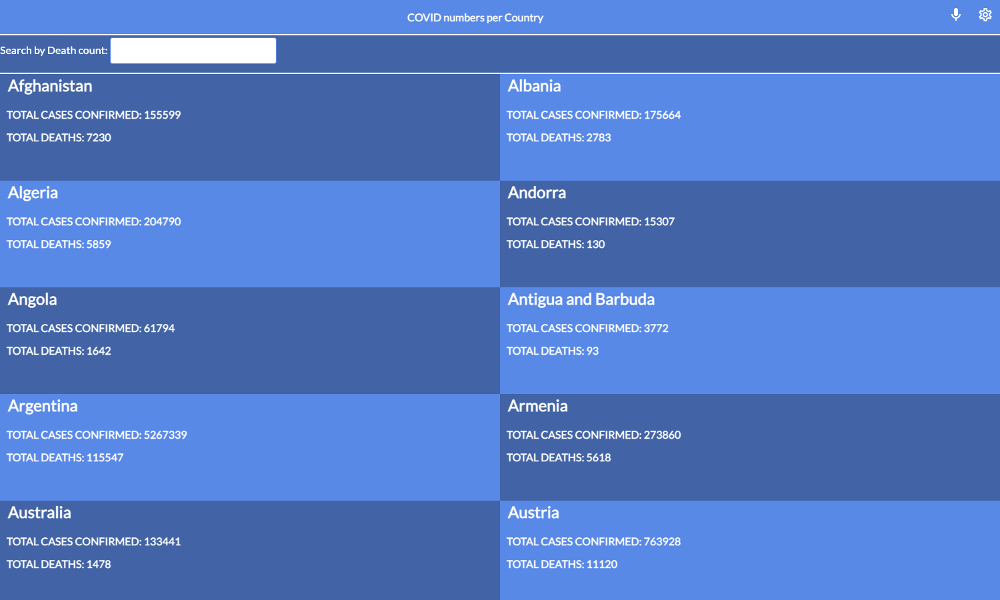
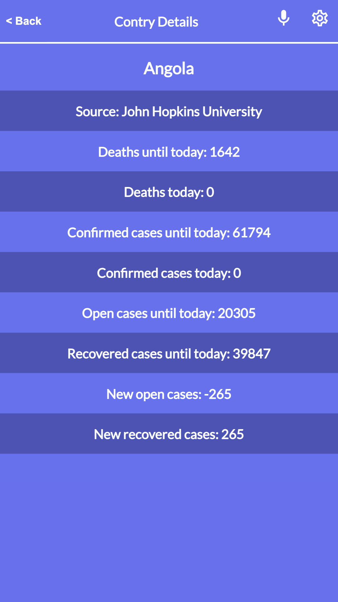

# React Metrics

> React Metrics is a single page web application that shows the current Covid 19 data stats. It works directly with real live data from the Narrativa API. The application will allow users to to look up covid stats based on the number of deaths through a filter search.
## Screenshots
Width - 1440px

  

 
Width - 375px

  

## Built With

- React
- Redux
- CSS
- Jest

## Live Demo

[Live Demo Link](https://lucid-ptolemy-f1afc5.netlify.app/)

## Video Presentation
[Video Presentation](https://www.loom.com/share/f7e2ff7614d4472b8f4d67f26c957225)

## Getting Started

### To get a local copy run the following steps:

- Open your terminal or command line and run `git clone https://github.com/mmatongo/react-metrics.git`
- Open the folder with your code editor (VS Code for example)
- Run `npm install`
- Run `npm run build`
- Run `npm start` to launch the server and view it in the browser.

## Author

👤 **Daniel M. Matongo**

- GitHub: [@mmatongo](https://github.com/mmatongo)
- LinkedIn: [Daniel M. Matongo](https://linkedin.com/in/mmatongo)

## 🤝 Contributing

Contributions, issues, and feature requests are welcome!

Feel free to check the [issues page](https://github.com/mmatongo/react-metrics/issues).

## Show your support

Give a ⭐️ if you like this project!

This project is [MIT](./MIT.md) licensed.